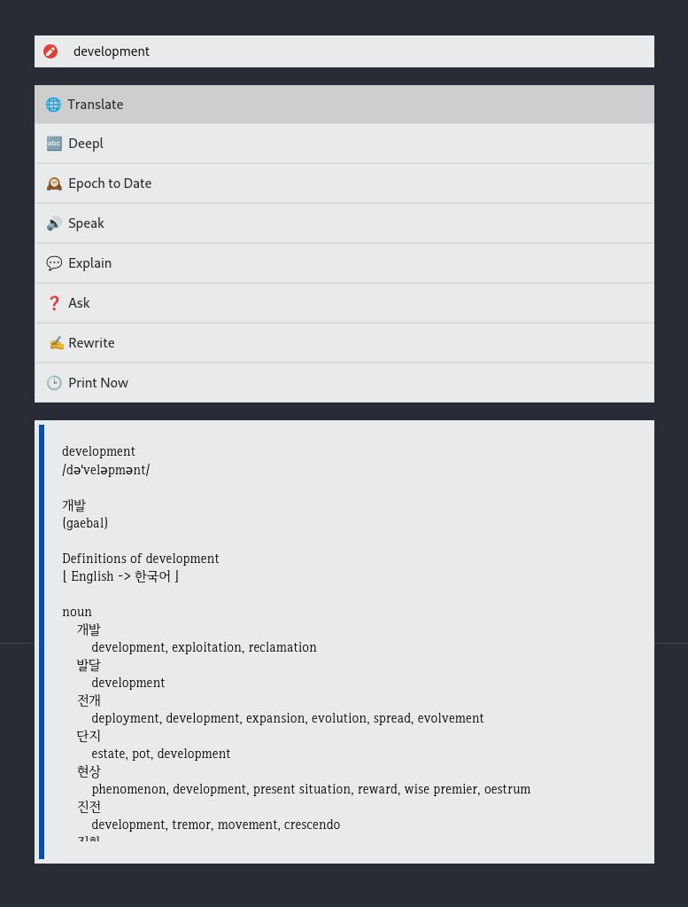

# roki

**roki** is a customizable action launcher inspired by tools like [rofi](https://github.com/davatorium/rofi).

## Screenshots



## Why? 

roki was created to execute the commands I use frequently more quickly.

- Check the meaning of a word using [Translate Shell](https://www.soimort.org/translate-shell/)
- Check the pronunciation of sentences or words using [piper](https://github.com/rhasspy/piper)
- Translate using DeepL
- Asking simple questions to ChatGPT using [aichat](https://github.com/sigoden/aichat)

## My Settings

In roki [config.yaml](examples/config.yaml)

```yaml
# ~/.config/roki/config.yaml
actions:
  - name: "🌐  Translate"
    command: "dict.sh '{}'"

  - name: "🔤  Deepl"
    command: "deepl text --to ko '{}'"

  - name: "🕰️  Epoch to Date"
    command: "date -d @{} '+%Y-%m-%d %H:%M:%S'"

  - name: "🔊  Speak"
    command: "speak '{}'; echo {}"

  - name: "💬  Explain"
    command: "echo '{}' | aichat '한글로 의미를 설명해. markdown이 아닌 plaintext 형식으로 응답해'"

  - name: "❓  Ask"
    command: "aichat '{}'"

  - name: " ✍️ Rewrite"
    command: "echo '{}' | aichat 'Rewrite this sentences to make it sound more professional and formal while keeping the original message intact.'"

  - name: "🕒  Print Now"
    command: "date '+%Y-%m-%d %H:%M:%S'; date +%s"
```

In xmonad,

```haskell
    , ((modm              , xK_e     ), spawn "roki.sh")
```

where `roki.sh` is a script that executes `roki` with the text selected in X or without any arguments if no text is selected.

```bash
#!/bin/bash

text=$(xsel -o)

if [ -z "$text" ]; then
    ~/Projects/roki/target/release/roki
else
    ~/Projects/roki/target/release/roki -i "$text"
fi
```
